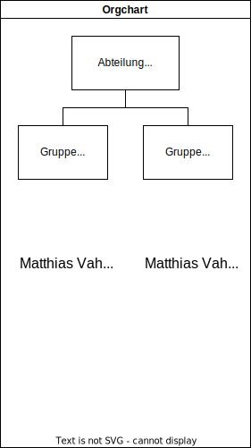

# Start

## Abschnitt

- eins
- zwei
- drei
- 

[MAG CHange](MAG_change.md)

[Abschnitt](#abschnitt)

:::mermaid
sequenceDiagram
    Alice ->> Bob: Hello Bob, how are you?
    Bob-->>John: How about you John?
    Bob--x Alice: I am good thanks!
    Bob-x John: I am good thanks!
    Note right of John: Bob thinks a long long time, so long that the text does not fit on a row.

    Bob-->Alice: Checking with John...
    Alice->John: Yes... John, how are you?
:::

:::mermaid
    mindmap
    [Matthias Vahl Abteilungsleiter]
        (Matthias Vahl Gruppensleiter)
            (Tom Krause)
            (Tim Dolereit)
            (Tom Krause)
            (Tim Dolereit)
            (Tom Krause)
            (Tim Dolereit)
            (Tom Krause)
            (Tim Dolereit)
        (Kristine Bauer)
            (Felix Schmidt)
            (Kai Gerrit XXX)
            (Felix Schmidt)
            (Kai Gerrit XXX)
            (Felix Schmidt)
            (Kai Gerrit XXX)
            (Felix Schmidt)
            (Kai Gerrit XXX)

:::

:::mermaid
    gantt
    section Section
    Completed :done,    des1, 2014-01-06,2014-01-08
    Active        :active,  des2, 2014-01-07, 3d
    Parallel 1   :         des3, after des1, 1d
    Parallel 2   :         des4, after des1, 1d
    Parallel 3   :         des5, after des3, 1d
    Parallel 4   :         des6, after des4, 1d
:::

    Matthias_Vahl-->B;

:::mermaid
    pie title Projektmix
        "Öffentlich" : 4
        "Eigen" : 5
        "Industrie" : 7
:::

:::mermaid
quadrantChart
    title Reach and engagement of campaigns
    x-axis Low Reach --> High Reach
    y-axis Low Engagement --> High Engagement
    quadrant-1 We should expand
    quadrant-2 Need to promote
    quadrant-3 Re-evaluate
    quadrant-4 May be improved
    Campaign A: [0.3, 0.6]
    Campaign B: [0.45, 0.23]
    Campaign C: [0.57, 0.69]
    Campaign D: [0.78, 0.34]
    Campaign E: [0.40, 0.34]
    Campaign F: [0.35, 0.78]
:::

# Auto Deploy is a wish

To streamline the merging and deployment process, this wiki automatically deploys upon merge to `master`.

In future, we're hoping to add preview environments for each PR.

__Note__: This process isn't live, yet.

## How does it work?

Here's how the autodeploy works:

### 1. PR is merged

After a successful code review, the PR is merged. On merge, a GitHub Actions workflow starts.

### 2. Download to Production Server

The workflow downloads the project to the production server using `git fetch`, `git checkout` and `git pull`.

### 3. Build Site

The workflow builds the exact same container as in local development, so the output build is exactly the same. Unlike local development, this doesn't spin up a development server, instead it saves the site to the filesystem.

!!! note "Production vs Development"
    The development server which comes with `mkdocs` isn't suited, nor suitable, for a production environment. For this, we build a custom container based off [NGINX](https://hub.docker.com/_/nginx/), which is far better suited, and allows for more control over the server. This container is built locally on the production server and is not pushed to any registry. 

### 4. Restarting Container and Prune

Once the build of the site is complete the custom container (please see the note below) is started on the server using `docker-compose`. Within the same step old images are pruned. This is done automatically as quickly as possible, to minimize potential downtime during the switchover.

## Configuration

The configuration for all this is available on [GitHub](https://github.com/selfhostedshow/).

Some notable files:

- [GitHub Actions deploy workflow](https://github.com/selfhostedshow/wiki/blob/master/.github/workflows/deploy.yml)
- wiki [`docker-compose.yml`](https://github.com/selfhostedshow/infra/blob/master/ansible/group_vars/demo.yaml#L133)
